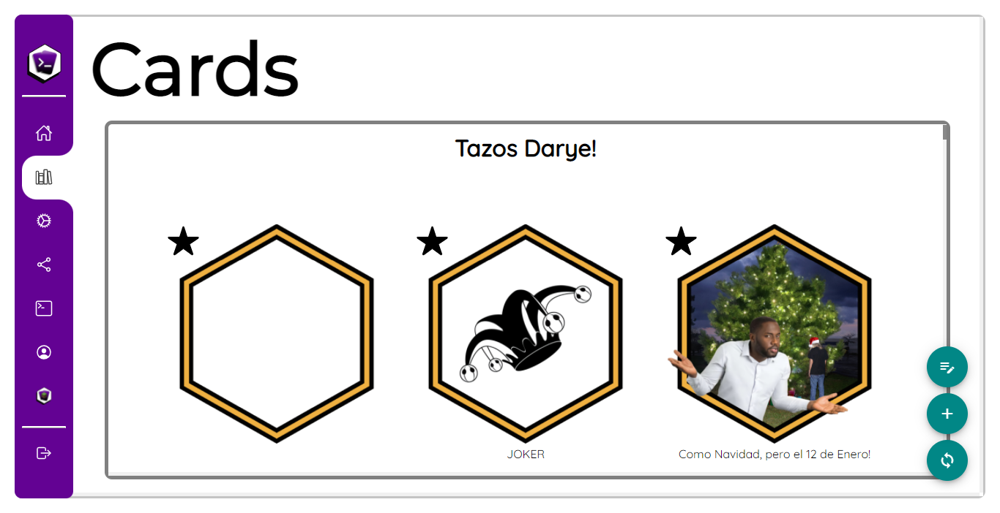

# Enhancing Cards

## Method 1: Enhance Card directly

To make a **Card** "Enhanced", go to the **Card Page** (<ion-icon name="library-outline"></ion-icon>) on the UI and click on the **Card** you want to enhance. Two options will appear: Click "Enhance Card".

{: style="margin: auto;}

And *voilà*, **Card** Enhanced!

Check out [Cards](./normalCards.md) and [Advanced Cards](./advCards.md) for examples and to know how to make your own Cards.

---

## Method 2: Redeem Card to enhance

To make a **Card** "Enhanced", go to the **Card Page** (<ion-icon name="library-outline"></ion-icon>) on the UI and click the *Enhance* Button (<ion-icon name="add-circle-outline"></ion-icon>).

{: style="margin: auto;}

Then, a prompt will pop-up asking you to use the **Card** you want to Enhance and, when the alert on the UI appears, click "Continue".

{: style="margin: auto;}

And, just like this, your **Card** is now **Enhanced**!

Check out [Cards](./normalCards.md) and [Advanced Cards](./advCards.md) for examples and to know how to make your own Cards.
