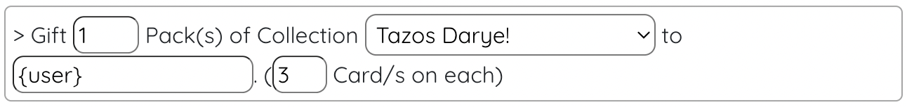
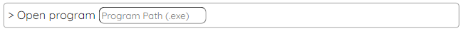

# Cards

This type of Card execute Commands on redeem. 

This commands can easily be edited on **Loot's Tools' Card Editor** .
<br>To open it, click on the Card and then "Edit Card Commands" to open the Card's page, or click the Editor Button ( :material-playlist-edit: ) to open the Editor, to then select your Card on the selector.

---

## Examples

Normal cards are pretty easy to make, let's see a couple of examples:

### Alt+F4

This infamous prank, on a Card form, would be as simple as IRL: only pressing two keys and watch the rage emerge.

[Copy Card "Alt+F4" on your Collection with LootsTrading](lootstools://copyCard/5fb7e18069cff0003945a512){ .md-button .md-button--primary target="_blank" rel="noopener noreferrer"}

This is as easy as one command:


The `Send Keystroke` command sends a combination of keys, being the best for easy mischiefs like this or Rickrolls... >:)

### Gift Chest

Having a "*You won a Chest*" Card in any streamer's Streamloots Collection is very common, and a strike of luck always gets a smile on the viewer's face, but it always interrupts the action on the stream; here's the Solution: (Also as easy as one command ;D)

[Copy Card "Gift Chest" on your Collection with LootsTrading](lootstools://copyCard/5e692668982ade003456a0c2){ .md-button .md-button--primary target="_blank" rel="noopener noreferrer"}



We can modify the number of Packs, the collection the Pack is of and the user to give the Packs to (`{user}` represents the user that redeemed the Card. Learn more on Tags [here](#tags).).

### Goodbye Stream!

Chat always likes to troll a bit, and nothing is worse than literally letting them close the stream your people are watching.

This can be achieved by *EXtensions*, a feature of [***Loot's Tools Plus***](../../plus), and in this case, we will be using the OBS one, which allows control over this streaming tool on things like ending our stream, changing source settings, changing texts...

[Copy Card "Goodbye Stream!" on your Collection with LootsTrading](lootstools://copyCard/5fa9381dc1826900346e680c){ .md-button .md-button--primary target="_blank" rel="noopener noreferrer"}

To cut off the stream with a Card, this is the command it has to execute:


(You can always use as many Commands as you want, obviously, but I focused the examples on fun little commands that will refresh your streams.)

---

## Commands

By default, ***Loot's Tools*** offers a selection of Commands out of the box:

### Gift Chest 

This Command allows the Streamer to gift a certain amount of Packs of a given collection to a user.

#### Usage


#### Arguments

- **user** [str]: The user to gift the Pack to.
- **quantity** [int]: The amount of Packs to gift.
- **collectionName** [str] (Optional): The Collection you want the Pack to be of. If not given, it defaults to the main Collection.

### Write

This Command simulates being the keyboard and writes the given string.

#### Usage


#### Arguments

- **text** [str]: The string to be written.

### Run Program
This Command runs a program.

#### Usage



#### Arguments

- **path** [str]: The path to the program to run.

### Run and Close Program
This Command runs a program, and then closes it in x seconds.

#### Usage


#### Arguments

- **path** [str]: The path to the program to run.

- **seconds** [int]: The number of seconds to wait until the program closes.

### Send Keystrokes

This Command simulates being the keyboard and sends a key combination.

#### Usage


#### Arguments

- **keyCombination** [str]: The key combination to send.

### Wait

This Command waits x seconds to resume execution of the Card's Commands.

#### Usage


#### Arguments

- **seconds** [int]: The number of seconds to wait.

### Print

This Command prints on the ***Loot's Tools*** Console Log.

#### Usage


#### Arguments

- **text** [str]: The text to print.

---

## Tags

*Tags* are a way to introduce variables on Commands when making them, let's see what *Tags* are available:

### {user}

This *Tag* is substituted by the user that redeemed the Card, useful for gifting Packs or making personalized rewards.

### {streamer}

This *Tag* is substituted by the Streamer that the user is redeeming the Card on.

### {cardName}

This *Tag* is substituted by the name of the Card redeemed.

### {rarity}

This *Tag* is substituted by the name of the rarity of Card redeemed.

(Possible values: ````common````, ````rare````, ````epic```` or ````legendary````)

### Additional Tags

If the Card requires input, the input's internal name can be used as a *Tag*.

For example: 

In this Card, an additional *Tag* would be ````{message}````.

---

## EXtensions

*EXtensions* are a feature unlocked with [***Loot's Tools Plus***](../../plus) which allows Normal Cards to have even more Commands available.

The *EXtensions* currently available are the following:

- [Loot's Tools EX for Minecraft](../../extensions/minecraft)
- [Loot's Tools EX for Twitch](../../extensions/twitch)
- [Loot's Tools EX for OBS](../../extensions/obs)
- [Loot's Tools EX for Discord](../../extensions/discord)

Learn more about EXtensions [here](../../extensions) and about each EXtension on their respective page.
