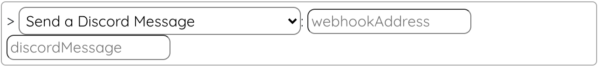

# LootsToolsEX for Discord 

(This is a feature unlocked with [***Loot's Tools Plus***](../../plus). A ***Plus*** Account is required.)

{: style="height: 150px;width: 150px;float: left;margin: 20px;"}

*LootsToolsEX for Discord* is an *EXtension* which allows the interactivity between **Discord** and ***Loot's Tools***.

It makes possible things like **sending messages** to Channels through **WebHooks**.

Uses for this could be sending **Twitch Clips**, **Card Alerts** or **Packs Purchased Alerts** to your server through **WebHooks**.

Learn how to make **Webhooks** on your Discord Server [here](https://support.discord.com/hc/en-us/articles/228383668#:~:text=MAKING%20A%20WEBHOOK).

---

## Installation

[Download 'Loot's Tools EX for Discord' with LaTEX](ltex://download/discordEX){ .md-button .md-button--primary }

---

## Commands

(Note: the name between parenthesis is the function's name, used for calling them with [Advanced Cards](../../cards/advCards.md)' Scripts)

=======
### Send a Discord Message (discordSend)

This command sends a message to your Chat on Twitch.

#### Usage

{style=max-width:60%;}

#### Arguments

- **webhookAddress** [str]: The webhook address.
- **discordMessage** [str]: The message you want to send.
