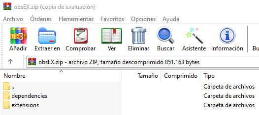

# Introduction to EXtensions

<sup style="font-size: 90%">(This is a feature unlocked with [***Loot's Tools Plus***](../../plus). A ***Plus*** Account is required.)</sup>

*EXtensions* are, as the name suggests, extensions for ***Loot's Tools***. 

They can provide more Commands for [Normal Cards](../cards/normalCards.md), useful functions for [Advanced Cards](../cards/advCards.md) or even completely new Interpreters (for Cards).

---

## Instalation

### Manual Method

EXtensions come packed on a ZIP file, with the EXtension in itself and its Dependencies.

<br>
<sup>Example of a *EXtension Package* content, in this case, of LootsToolsEX for OBS.</sup>

To install them you only need to unzip the *Package* into ```<Loot's Tools' Root Folder>```.

---

### LaTEX Method

fee

---

## Available EXtensions

There are a few *EXtensions* available right now, but developers can make their own ([More info clicking here](developers))

- [Loot's Tools EX for Minecraft](../../extensions/minecraft)
- [Loot's Tools EX for Twitch](../../extensions/twitch)
- [Loot's Tools EX for OBS](../../extensions/obs)

---

## Create your EXtensions

If you are a developer and/or you want to make an *EXtension*, head over to [*Create EXtensions*](developers) to know how.