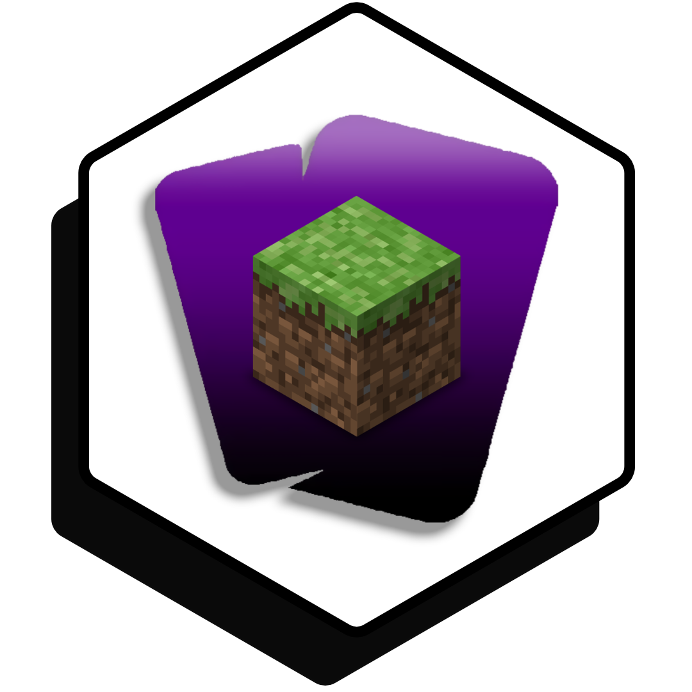
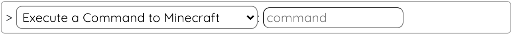
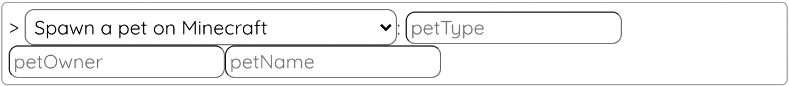

# LootsToolsEX for Minecraft

<sup style="font-size: 90%">(This is a feature unlocked with [***Loot's Tools Plus***](../../plus). A ***Plus*** Account is required.)</sup>

{: style="height: 150px;width: 150px;float: left;margin: 20px;"}

*LootsToolsEX for Minecraft* is an *EXtension* which allows the interactivity between **Minecraft** and ***Loot's Tools***.

It makes possible sending **commands** to the game and **giving pets** to players in the game.

You can see some example clips of *LootsToolsEX for Minecraft* in-game [here](https://www.youtube.com/watch?v=BqhNUN1Ft6w){target=_blank}, [here](https://www.youtube.com/watch?v=LNAmppbpLXA){target=_blank}, or [here](https://www.youtube.com/watch?v=LBEQGj77ftQ){target=_blank}.

---

## Installation

[Download 'Loot's Tools EX for Minecraft' with LaTEX](ltex://download/minecraftEX){ .md-button .md-button--primary }

---

## Setup

It's needed for this *EXtension* to work a *Paper*, *Bukkit* or *Spigot* Minecraft server, and this plugin ([Loot's Tools for Minecraft (1.13 - 1.18)](https://www.spigotmc.org/resources/loots-tools-for-minecraft.99127/)) installed on it.

It's **very important** to start **first** Loot's Tools and **then** the Minecraft Server.

---

## Commands

(Note: the name between parenthesis is the function's name, used for calling them with [Advanced Cards](../../cards/advCards.md)' Scripts)

### Execute a Command on Minecraft (minecraftCMD)

This command sends a command to Minecraft to execute.

#### Usage

{style=max-width:60%;}

#### Arguments

- **command** [str]: The command you want to execute on Minecraft.

### Spawn a pet on Minecraft (minecraftPet)

This command summons a Pet for the player specified on Minecraft.

#### Usage

{style=max-width:60%;}

#### Arguments

- **petAttributes** [json]: The pet's atributes. Example: ```{"Type":"DOG","Owner":"ALL","Name":"woof"}```.

##### Pet Attributes

- ```Type```: The type of Pet. Possible values: ```DOG```, ```CAT```, ```PARROT```.
- ```Owner```: The Owner of the Pet. If it's ```ALL```, a Pet is given to every player online.
- ```Name```: The name of the Pet.

---

## Additional Notes

If on the command of [```Execute a Command on Minecraft```](#execute-a-command-on-minecraft-minecraftcmd) you put ```%PLAYER%```, that command is executed for every player online, replacing the tag for their names.
