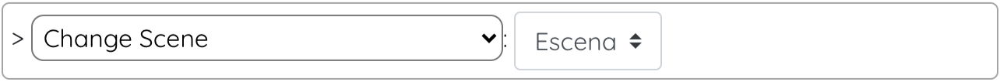
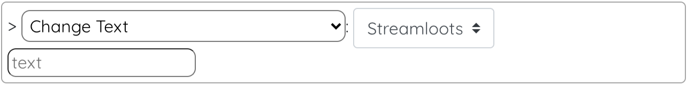
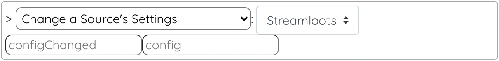
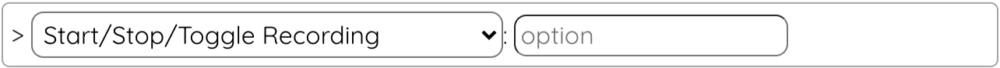
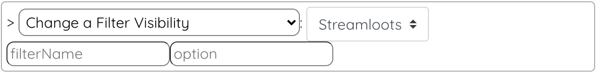
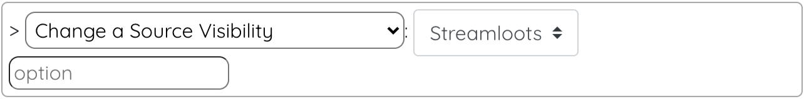

# LootsToolsEX for OBS

<sup style="font-size: 90%">(This is a feature unlocked with [***Loot's Tools Plus***](../../plus). A ***Plus*** Account is required.)</sup>

{: style="height: 150px;width: 150px;float: left;margin: 20px;"}

*LootsToolsEX for OBS* is an *EXtension* which allows controlling **OBS** with ***Loot's Tools***.

It makes possible things like **changing scenes**, **changing** the **text** of a Text Source, **changing Source Settings** , **muting Sources** and **toggle Recording** and **Streaming**.

&nbsp;

&nbsp;

---

## Installation

[Download 'Loot's Tools EX for OBS' with LaTEX](ltex://download/obsEX){ .md-button .md-button--primary }

---

## Setup

You need to have installed ```OBS Websocket```on your OBS. You can download it [here](https://github.com/Palakis/obs-websocket/releases/latest)

---

## Commands

(Note: the name between parenthesis is the function's name, used for calling them with [Advanced Cards](../../cards/advCards.md)' Scripts)

### Change Scene (obsChangeScene)

This command changes the active Scene on OBS.

#### Usage

{style=max-width:60%;}

#### Arguments

- **scene** [choose]: The scene you want to change to.

### Change Text (obsChangeText)

This command changes the text of a Text Scene on OBS.

#### Usage

{style=max-width:60%;}

#### Arguments

- **source** [choose]: The Text Source you want to change the text from.
- **text** [str]: The text you want to be changed to.

### Change a Source's Settings (obsChangeSettings)

This command changes the Settings of a Source on OBS.

#### Usage

{style=max-width:60%;}

#### Arguments

- **source** [choose]: The Source you want to change the setting of.
- **configChanged** [str]: The Setting you want to change.
- **config** [str]: The value you want the Setting to be.

### Mute a Source (obsMute)

This command mutes a Source on OBS.

#### Usage

{style=max-width:60%;}

#### Arguments

- **source** [choose]: The name of the Source to mute/unmute.
- **option** [str] (Optional): ```mute``` or ```unmute```. If not specified, it toggles the mute.

### Start/Stop/Toggle Streaming (obsStreaming)

This command toggles Streaming on OBS.

#### Usage

{style=max-width:60%;}

#### Arguments

- **option** [str]: Possible values: ```start```, ```stop``` or ```toggle```.

### Start/Stop/Toggle Recording (obsRecording)

This command toggles Recording on OBS.

#### Usage

{style=max-width:60%;}

#### Arguments

- **option** [str]: Possible values: ```start```, ```stop```, ```toggle```, ```pause``` or ```resume```.

### Change a Filter Visibility (obsChangeFilterVisibility)

This command toggles a Filter's Visibility on OBS.

#### Usage

{style=max-width:60%;}

#### Arguments

- **source** [choose]: The source that has the filter you want to change the visibility of.
- **filterName** [str] The name of the filter you want to change the visibility of.
- **option** [str] Possible values: ```visible``` or ```invisible```.

### Change a Source Visibility (obsChangeItemVisibility)

This command toggles an Item's Visibility on OBS.

#### Usage

{style=max-width:60%;}

#### Arguments

- **source** [choose]: The source you want to change the visibility of.
- **option** [str] Possible values: ```visible``` or ```invisible```.
