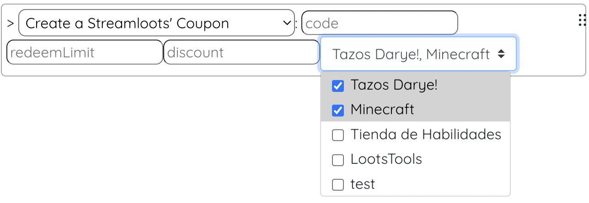
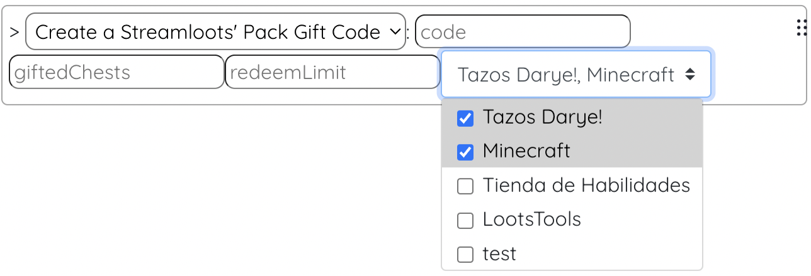
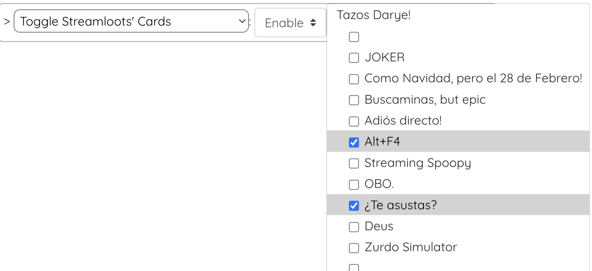
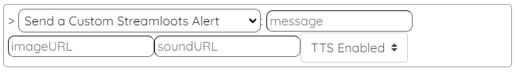

# LootsToolsEX for Streamloots 

(This is a feature unlocked with [***Loot's Tools Plus***](../../plus). A ***Plus*** Account is required.)

{: style="height: 150px;width: 150px;float: left;margin: 20px;"}

*LootsToolsEX for Streamloots* is an *EXtension* which allows the interactivity between **Streamloots** and ***Loot's Tools***.

It makes possible things like **creating Discount Codes**, **creating Gift Packs Codes**, or **Enabling or Disabling Cards on a Collection**, to make it more dynamic.

&nbsp;

---

## Installation

[Download 'Loot's Tools EX for Streamloots' with LaTEX](ltex://download/streamlootsEX){ .md-button .md-button--primary }

---

## Commands

(Note: the name between parenthesis is the function's name, used for calling them with [Advanced Cards](../../cards/advCards)' Scripts)

### Create a Streamloots' Coupon (createCoupon)

This command creates a Coupon Discount Code on Streamloots.

#### Usage

{style=max-width:60%;}

#### Arguments

- **code** [str]: The Coupon Code.
- **redeemLimit** [int]: The limit redeem number of the Coupon.
- **discount** [int]: The discount percentage that the Coupon has. (Can be input as 0.1 or 10, for 10% for example). (MAX 75%)
- **collectionList** [chooseMultiple]: The list of the Collections where the Coupon is valid.

---

### Create a Streamloots' Pack Gift Code (createGiftCode)

This command creates a Gift Code on Streamloots.

#### Usage

{style=max-width:60%;}

#### Arguments

- **code** [str]: The Coupon Code.
- **redeemLimit** [int]: The limit redeem number of the Coupon.
- **giftedChests** [int]: The Packs given when the code is used. The recommended ammount is 1.
- **collectionList** [chooseMultiple]: The list of the Collections where the Coupon is valid.

---

### Toggle Streamloots' Cards (toggleCards)

This command enables or disables Cards on your Streamloots Collections.

#### Usage

{style=max-width:60%;}

#### Arguments

- **option** [choose]: Enable or disable the Card. Possible options: "Enable" or "Disable".
- **cardAndCollectionsIDs** [chooseMultiple]: The Cards to enable or disable.

---

### Send a Custom Streamloots Alert (createGiftCode)

This command sends a Custom Alert on the Streamloots Alerts Browser Source.

#### Usage

{style=max-width:60%;}

#### Arguments

- **message** [str]: The Alert's Message.
- **imageURL** [str]: The Alert's Image URL.
- **soundURL** [str]: The Alert's Sound URL.
- **ttsEnabled** [choose]: Enable or disable TTS.
