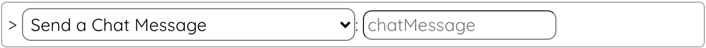
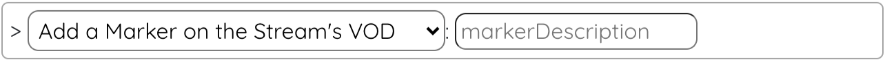
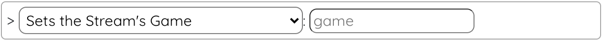
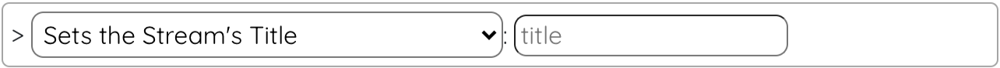
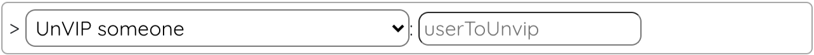
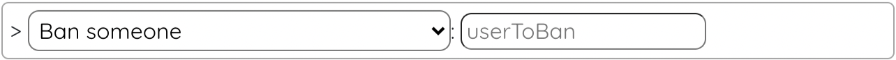

# LootsToolsEX for Twitch

<sup style="font-size: 90%">(This is a feature unlocked with [***Loot's Tools Plus***](../../plus). A ***Plus*** Account is required.)</sup>

{: style="height: 150px;width: 150px;float: left;margin: 20px;"}

*LootsToolsEX for Twitch* is an *EXtension* which allows the interactivity between **Twitch** and ***Loot's Tools***.

It makes possible things like **changing the** **Stream's Title** and **Game**, **sending messages** to Chat, **marking a moment** on the VOD, **getting the Stream's info** (Useful for [Advanced Cards](../../cards/advCards.md)), manage **VIPs** (*VIPing* and *unVIPing*), and **bans** (*banning* and *unbanning*).

Commands on Events like Subs, Chat Commands, Messages, Donations and Channel Points is being worked on.

&nbsp;

---

## Installation

[Download 'Loot's Tools EX for Twitch' with LaTEX](ltex://download/twitchEX){ .md-button .md-button--primary }

---

## Setup

After installing the *EXtension*, you need to provide some values in order for this *EXtension* to work:

- An OAuth Twitch Chat Token ([You can get it here](https://twitchapps.com/tmi/))
- A ClientID and a Client Secret of the same account ([You can learn how to get it here](http://faq.demostoreprestashop.com/faq.php?fid=144&pid=41))

Then, go to the ```Loot's Tools EX for Twitch``` page on Loot's Tools UI, and put your values and credentials there to set everything up.

---

## Commands

(Note: the name between parenthesis is the function's name, used for calling them with [Advanced Cards](../../cards/advCards.md)' Scripts)

### Send a Chat Message (twitchSend)

This command sends a message to your Chat on Twitch.

#### Usage

{style=max-width:60%;}

#### Arguments

- **message** [str]: The message you want to send.

### Add a Marker on the Stream's VOD (twitchMarker)

This command marks a moment in the VOD.

#### Usage

{style=max-width:60%;}

#### Arguments

- **markerDescription** [str] (Optional): The description of the marker.

### Set the Stream's Game (twitchSetGame)

This command sets the game of your Twitch's stream.

#### Usage

{style=max-width:60%;}

#### Arguments

- **game** [str]: The name of the game.


### Set the Stream's Title (twitchSetTitle)

This command sets the game of your Twitch's stream.

#### Usage

{style=max-width:60%;}

#### Arguments

- **title** [str]: The title you want to put on your Twitch's stream.


### VIP Someone (twitchVIP)

This command makes a user VIP on your Twitch's chat.

#### Usage

{style=max-width:60%;}

#### Arguments

- **user** [str]: The user you want to make VIP.


### UnVIP Someone (twitchUnVIP)

This command takes away a user's VIP on your Twitch's chat.

#### Usage

{style=max-width:60%;}

#### Arguments

- **user** [str]: The user from who you want to take away its VIP.


### Ban Someone (twitchBan)

This command bans a user from your Twitch's chat.

#### Usage

{style=max-width:60%;}

#### Arguments

- **user** [str]: The user you want to ban.

### Unban Someone (twitchUnban)

This command unbans a user from your Twitch's chat.

#### Usage

{style=max-width:60%;}

#### Arguments

- **user** [str]: The user you want to unban.
