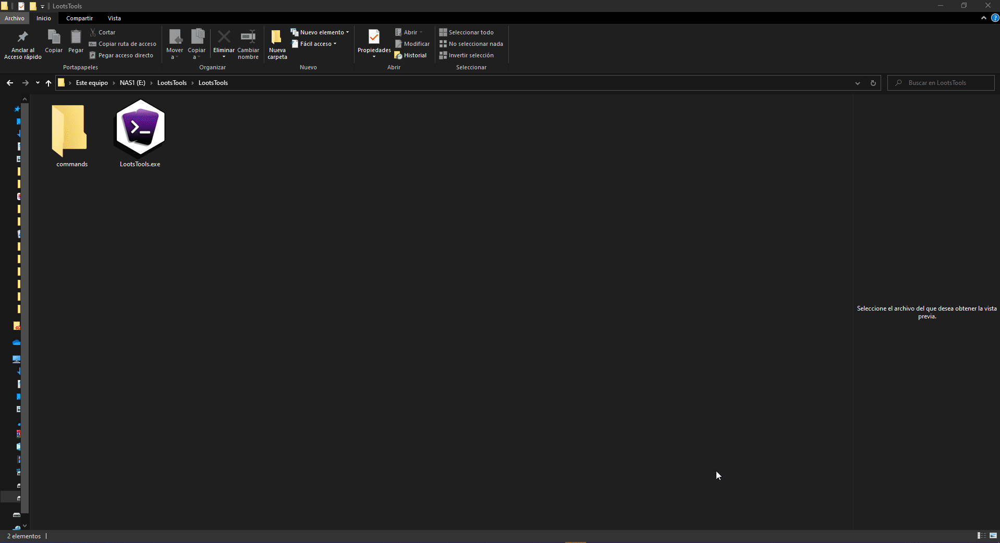
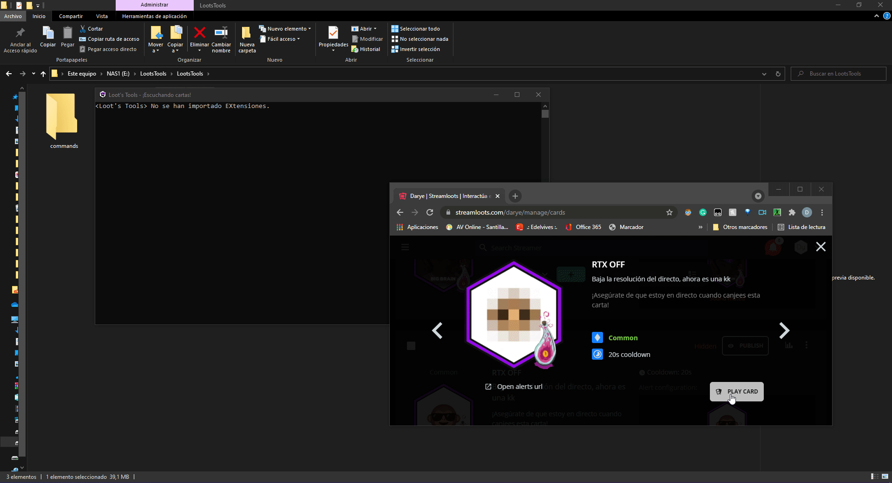

# Getting Started

So you're new around here, huh? I'm glad you stopped by!

Originality on streams is very important for me, thats why I made Loot's Tools, but let's not distract ourselves, let's see how you can start using ***Loot's Tools***!

---

## Download Loot's Tools

You can download the tool [clicking here](https://github.com/DaryeDev/LootsTools/releases/latest){target=_blank}.

Loot's Tools is very messy and needs its own space, so unzip it on his own folder


---

## Login with Streamloots

You need to login with Streamloots, so open ```LootsTools.exe``` and wait for the login screen to open.

Then, log in Streamloots with your account and Loot's Tools will manage the rest.



---

## Use a Card!

Once you redeem a Card, a folder for it will be created.



And that's all I can teach you for now! Continue on [Cards](/LootsTools/cards) to learn more about the process of making them.

<center>Share what you make or give suggestions on the [Discord Server](https://discord.io/Darye){target=_blank}!
<br>

<p style="font-size:35px; font-family: 'Montserrat'">Have fun with <b><i>Loot's Tools</b></i> !</p></center>
