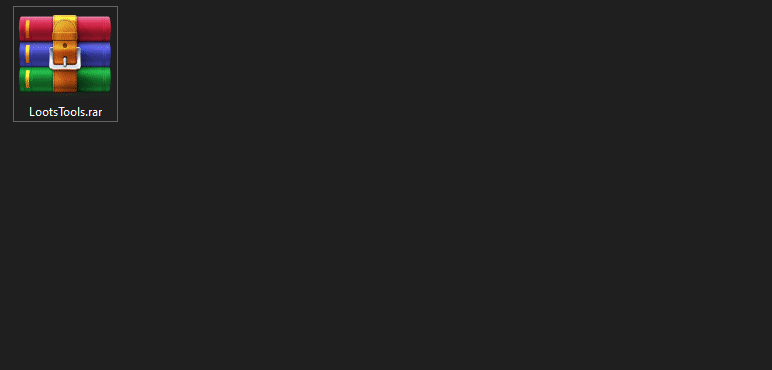
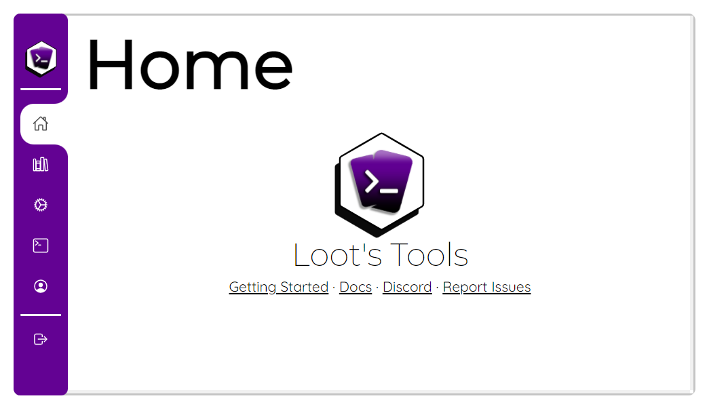
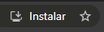

# Getting Started

So you're new around here, huh? I'm glad you stopped by!

Originality on streams is very important for me, thats why I made Loot's Tools, but let's not distract ourselves, let's see how you can start using ***Loot's Tools***!

---

## Download Loot's Tools

You can download the tool [clicking here](https://github.com/DaryeDev/LootsTools/releases/latest){target=_blank}.

Loot's Tools needs his own space, so create a new folder on your computer and *drop 'em in*!



---

## Set it up!

Open ```LootsTools.exe``` for first time to install and set up what it needs to work properly. 

You'll be prompted to restart, so restart your computer and lets continue with the setup!

---

## Login with Streamloots

Once you restart your computer, you'll need to login with Streamloots, so you'll need to install a Browser extension to login:

- [Download *Login to Loot's Tools* for Chrome](https://chrome.google.com/webstore/detail/login-to-loots-tools/nkoepodlaleolfmllaibllelcefbphfp){target=_blank}

- [Download *Login to Loot's Tools* for Firefox](https://addons.mozilla.org/en-US/firefox/addon/login-to-loot-s-tools/){target=_blank}

To log in, once you install the extension, go to [Streamloots](https://www.streamloots.com){target=_blank} and, once you log in on there, click on the extension's icon. Loot's Tools will open, but now you'll logged in.

---

## A fresh new face: Loot's Tools UI

Once you have installed ***Loot's Tools***, you can access the [*Loot's Tools UI*](https://lootstools.darye.dev/app){target=_blank} (or open ```LootsTools.exe```) and be greeted with ***Loot's Tools UI***.

<a href="https://lootstools.darye.dev/app">
{:style="margin: auto;"}
</a>

Continue learning about it clicking here: [Loot's Tools UI](lootsToolsUI.md)

---

## Optional: Install Loot's Tools UI as a Desktop App

When going to the [*Loot's Tools UI*](https://lootstools.darye.dev/app){target=_blank}, on **Chrome** appears an "Install" icon on the right side of the address bar: {: style="height: auto;margin: 10px"}

Clicking this, you can install the UI as a Desktop App, looking better and independent from the browser!

---

<center>Share what you make or give suggestions on the [Discord Server](https://discord.io/Darye){target=_blank}!
<br>

<p style="font-size:35px;">Have fun with <b><i>Loot's Tools</b></i> !</p></center>
