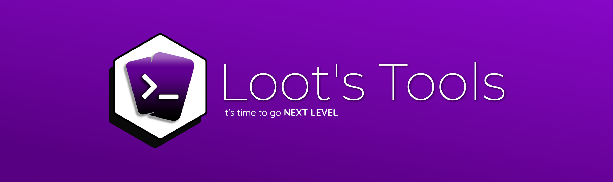

**Loot's Tools** is a tool for [Streamloots](https://streamloots.com){target=_blank}, to enhance its functionality and let the streamer have better and *Next Level* interactions between them and the audience.

Let it be controlled by the audience Minecraft Streams (Examples [here](https://www.youtube.com/watch?v=BqhNUN1Ft6w){target=_blank}, [here](https://www.youtube.com/watch?v=LNAmppbpLXA){target=_blank}, or [here](https://www.youtube.com/watch?v=LBEQGj77ftQ){target=_blank}), effects on camera, or anything that interacts with your game, stream, **IoT gadgets** around you\*, **gifting Packs** and much more; everything can now be controlled with Streamloots Cards and **Loot's Tools**!

(Some features need ***Loot's Tools Plus*** to be unlocked, learn more about it [here](plus).)

[Download](https://github.com/DaryeDev/LootsTools/releases/latest){target=_blank : style="font-size:22px"}   |   [Getting Started](gettingStarted){: style="font-size:22px"}  |  [Loot's Tools UI](https://lootstools.darye.dev/app){: style="font-size:22px"}
  |  [OBS Forums' Page](https://obsproject.com/forum/resources/loots-tools.1341/){target=_blank : style="font-size:22px;text-align: center;"}  |  [Discord Server](https://discord.io/Darye){target=_blank : style="font-size:22px"}  |  [Report Issues](https://github.com/DaryeDev/LootsTools/issues){target=_blank : style="font-size:22px"}

Continue on [Getting Started](gettingStarted).