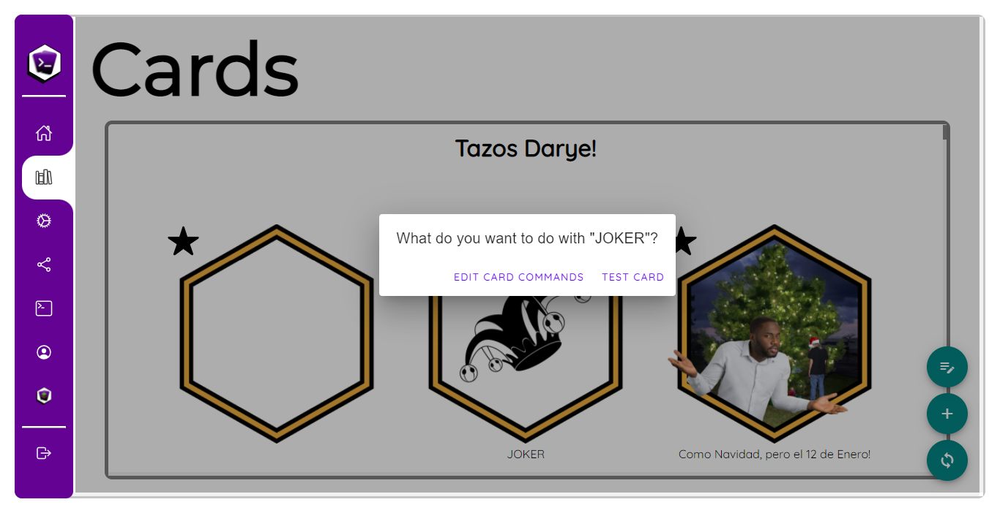
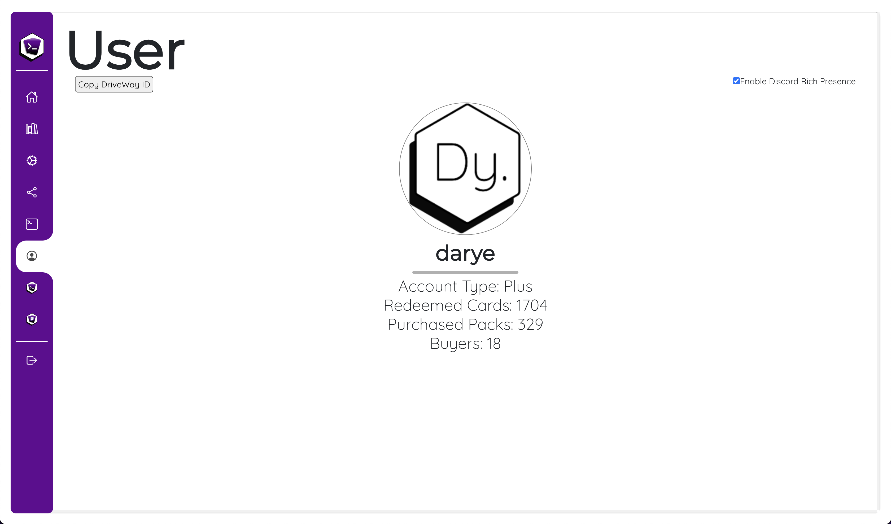

# Loot's Tools UI
<a href="https://lootstools.darye.dev">
{: style="margin: auto;}
</a>
Introduced on v2, ***Loot's Tools UI*** offers a new and friendlier way to use ***Loot's Tools***. 

You can access it on [lootstools.darye.dev](https://lootstools.darye.dev).

Opening the UI opens the **Loot's Tools Console**, if necessary; and opening the **Loot's Tools Console**, from the executable, opens the UI on load.

---

## Pages

The UI is divided on pages:

- [Home](#home)

- [Cards](#cards)

- [EXtensions](#extensions)

- [Log](#log)

- [User](#user)

---

### Home

{: style="margin: auto;}

The **Home Page** offers a handful of useful links for the **Start Guide**, **Docs**, **the Discord Server**, and the **Issues reporting page** on Github.

---

### Cards

{: style="margin: auto;}

The **Cards Page** offers a glimpse at the Cards of your Streamloots Collections, categorized by them. 

The Name and Icon of the Card is shown on a grid, and Enhanced Cards are marked with a star on the top-left corner.

Clicking on a Card offers the options to test the Card and other to open the Card's folder to edit its files.

{: style="margin: auto;}

Also, this page has two buttons, the **Enhance** Button (<ion-icon name="add-circle-outline"></ion-icon>), that makes a Card Enhanced, and the **Reload** Button (<ion-icon name="refresh-circle-outline"></ion-icon>), that reloads the Cards (Names, pictures and states).

---

### EXtensions

{: style="margin: auto;}

The **EXtensions Page** shows us the EXtensions that are loaded into **Loot's Tools**.

---

### Log

{: style="margin: auto;}

The **Log Page** shows the output of the **Loot's Tools Console**, with an auto scroll option.

---

### User

{: style="margin: auto;}

The **User Page** shows the User's Name and Icon, with some info about their stats on **Streamloots** and **Loot's Tools**

---

## Exiting the UI

Aside of closing the browser tab or window, the UI has an **Exit** button. (<ion-icon name="exit-outline"></ion-icon>).

On click, this button pops up a prompt to **Close only the UI** or **Close also the Loot's Tools Console**:

{: style="margin: auto;}

---

**Loot's Tools UI** is a **work in progress**, and suggestions are more than welcomed on the **Issues** page on Github ([Issues](https://github.com/DaryeDev/LootsTools/issues){target=_blank}) and on the **Discord Server** ([Discord Server](https://discord.io/Darye){target=_blank}).
