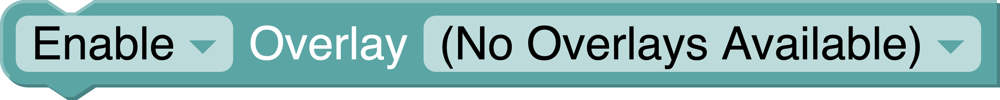

# Cards

This type of Card execute Commands on redeem. 

This commands can easily be edited on the **Loot's Tools' Editor** .
<br>To open it, click on the Card and then "Edit Card Commands" to open the Card's page, or click the Editor Button ( :material-playlist-edit: ) to open the Editor, to then select your Card on the selector.

---

## Examples

Normal cards are pretty easy to make, let's see a couple of examples:

### Alt+F4

This infamous prank, on a Card form, would be as simple as IRL: only pressing two keys and watch the rage emerge.

[Copy Card "Alt+F4" on your Collection with LootsTrading](lootstools://copyCard/5fb7e18069cff0003945a512){ .md-button .md-button--primary target="_blank" rel="noopener noreferrer"}

This is as easy as one command:

{: style="max-width: 800px;max-height: 100px;"}

The `Send Keystroke` command sends a combination of keys, being the best for easy mischiefs like this or Rickrolls... >:)

### Gift Chest

Having a "*You won a Chest*" Card in any streamer's Streamloots Collection is very common, and a strike of luck always gets a smile on the viewer's face, but it always interrupts the action on the stream; here's the Solution: (Also as easy as one command ;D)

[Copy Card "Gift Chest" on your Collection with LootsTrading](lootstools://copyCard/5e692668982ade003456a0c2){ .md-button .md-button--primary target="_blank" rel="noopener noreferrer"}

{: style="max-width: 800px;max-height: 100px;"}

We can modify the number of Packs, the collection the Pack is of and the user to give the Packs to (The `user` Block represents the user that redeemed the Card. Learn more on Tags [here](#tags).).

### Goodbye Stream!

Chat always likes to troll a bit, and nothing is worse than literally letting them close the stream your people are watching.

This can be achieved with *EXtensions*, a feature of [***Loot's Tools Plus***](../../../plus), and in this case, **we will be using [the OBS EXtension](../../extensions/obs)**, which allows control over this streaming tool on things like ending our stream, changing source settings, changing texts, etc.

[Copy Card "Goodbye Stream!" on your Collection with LootsTrading](lootstools://copyCard/5fa9381dc1826900346e680c){ .md-button .md-button--primary target="_blank" rel="noopener noreferrer"}

To cut off the stream with a Card, this is the command it has to execute:

{: style="max-width: 800px;max-height: 100px;"}

(You can always use as many Commands as you want, obviously, but I focused the examples on fun little commands that will refresh your streams.)

---

## Command Blocks

By default, ***Loot's Tools*** offers a selection of Command Blocks out of the box, categorized:

### Event Stuff & Tags

Includes the Starter Block and the different Tags available for that Event.

#### Starter

Starts an execution line of Commands. You can have *n* Starter Blocks to run those execution lines on parallel.

##### Usage

{: style="max-width: 800px;max-height: 50px;"}

On parallel...

{: style="height: 300px;"}

#### Tags

Variable data given by the Event, such as the user that redeemed the Event. It varies between Events.

{: style="max-height: 300px;"}

---

### Streamloots

This category includes Command Blocks related to Streamloots Automation or information, like gifting Packs or gathering the Active Streamloots' Subs.

#### Gift Packs

This Command Block allows the Streamer to gift a certain amount of Packs of a given collection to a user.

##### Usage

{: style="max-width: 800px;max-height: 50px;"}

#### Get Streamloots User ID

This Command Block gets the User ID from a Username.

##### Usage

{: style="max-width: 800px;max-height: 50px;"}

#### Get Streamloots Username

This Command Block gets a Username from a User ID.

##### Usage

{: style="max-width: 800px;max-height: 50px;"}

#### Create Streamloots Coupon Code

This Command Block allows the Streamer to make a Coupon Code on Streamloots, controlling the Code, the percentage off, the Collections to apply it to, and the redeem limit.

Returns the URL of the Coupon Code.

##### Usage

{: style="max-width: 800px;max-height: 100px;"}

#### Create Streamloots Gift Code

This Command Block allows the Streamer to make a Gift Code on Streamloots, controlling the Code, the amount of Packs given, the amount of Cards, the Collections to apply it to, and the redeem limit.

Returns the URL of the Gift Code.

##### Usage

{: style="max-width: 800px;max-height: 100px;"}

#### Toggle Streamloots Cards

This Command Block allows the Streamer to toggle a Card to visible or hidden.

##### Usage

{: style="max-width: 800px;max-height: 100px;"}

#### Send Streamloots Alert

Want to announce something with your Streamloots Alert Widget or simulate someone had used a Card?

This Command Block allows you to send an alert to your Streamloots Alerts on Stream, allowing to modify the *message*, *imageURL*, *audioURL* and toggle TTS.

##### Usage

{: style="max-width: 800px;max-height: 50px;"}

#### Pause and Resume Streamloots Collections

This Command Block allows the Streamer to pause and resume Streamloots Collections, for example, to make a Collection available only for 5 mins when a Card is used.

##### Usage

{: style="max-width: 800px;max-height: 50px;"}

{: style="max-width: 800px;max-height: 50px;"}

#### Get Streamloots Active Subs

This Command Block returns a list of the active Subs on Streamloots (Usernames).

##### Usage

{: style="max-width: 800px;max-height: 50px;"}

#### Collection

This Block returns the ID of the Collection selected.

##### Usage

{: style="max-width: 800px;max-height: 50px;"}

#### Card

This Block returns the ID of the Card selected and its Collection on a List. (`[cardID, collectionID]`)

##### Usage

{: style="max-width: 800px;max-height: 50px;"}

#### LootsLabels

LootsLabels gives the user "Labels" with stats of theirs Streamloots' Page on real time, such as Packs sold, top Buyer/Redeemer or last redeemed Card's data; for then using them on your Streaming Software or Commands.

These blocks return the value, but some, like the "Top Buyer**s**" ones, returns a list.

##### Usage

{: style="max-width: 400px"}

---

### Overlay

This category includes Command Blocks related to the [Loot's Tools Overlay](../../overlay), a way to display images on top of your Screen.

#### Toggle Overlay

This Command Block allows toggling an Overlay on or off.

##### Usage

{: style="max-width: 800px;max-height: 50px;"}

{: style="max-width: 800px;max-height: 50px;"}

---

### Sounds

This category includes Command Blocks related to sound, such as playing sounds or using TTS.

#### Play Sound

This Command Block plays an audio file.

##### Usage

{: style="max-width: 800px;max-height: 50px;"}

#### TTS

This Command Block reads a text aloud with TTS.

##### Usage

{: style="max-width: 800px;max-height: 50px;"}

---

### Loot's Tools

This category includes Command Blocks to interact with Loot's Tools and its Services and Tools.

#### Print

This Command Block prints something on the [Log](../../lootsToolsUI#log).

##### Usage

{: style="max-width: 800px;max-height: 50px;"}

#### Translate User

This Command Block allows to translate usernames or IDs between Services, such as Streamloots, Discord or Twitch.

**IMPORTANT NOTE: This will only work if the user has synced their accounts with the [Loot's Tools Browser Companion](../../../browserCompanion)**

##### Usage

{: style="max-width: 800px;max-height: 50px;"}

---

### Keyboard

This category includes Command Blocks regarding Keyboard Stuff, such as modifying, blocking, holding or clicking Keys.

#### Block Keys

This Command Block blocks the Keys specified from being pressed for a specified time.

##### Usage

{: style="max-width: 800px;max-height: 100px;"}

#### Modify Keys

This Command Block modify the Keys specified to press other Key when pressed for a specified time.

##### Usage

{: style="max-width: 800px;max-height: 100px;"}

#### Hold Keys

This Command Block hold the Keys specified for a specified time.

##### Usage

{: style="max-width: 800px;max-height: 100px;"}

#### Send Keystroke

This Command Block presses the specified Keystroke (ej. Alt+F4).

##### Usage

{: style="max-width: 800px;max-height: 50px;"}

#### Write as your Keyboard

This Command Block simulates the Keyboard and writes a String as if you were the one writing it.

##### Usage

{: style="max-width: 800px;max-height: 50px;"}

#### Key

This Block allows to select a Key to use on the different [Keyboard](#keyboard) commands.

##### Usage

{: style="max-height: 300px;"}

---

### Control

This category includes Command Blocks regarding controlling the flow of the execution line.

#### Wait

This Command Block waits a certain time before executing the next Block.

##### Usage

{: style="max-width: 800px;max-height: 50px;"}

---

### Open Programs

This category includes Command Blocks that opens Programs. Really straightforward.

#### Open and Close Program

This Command Block runs the program with the specified path, then closes it on the specified time.

##### Usage

{: style="max-width: 800px;max-height: 50px;"}

#### Open Program

This Command Block runs the program with the specified path.

##### Usage

{: style="max-width: 800px;max-height: 50px;"}

---

### Comment

This category includes Comment Blocks. They aren't executed, but are useful to explain what a section of the Code does.

#### Comment Block

This Block isn't executed, but useful to explain what a section of the Code does.

##### Usage

{: style="max-width: 800px;max-height: 50px;"}


<!-- ### Gift Chest 

This Command allows the Streamer to gift a certain amount of Packs of a given collection to a user.

#### Usage

{: style="max-width: 800px;max-height: 50px;"}

#### Arguments

- **user** [str]: The user to gift the Pack to.
- **quantity** [int]: The amount of Packs to gift.
- **collectionName** [str] (Optional): The Collection you want the Pack to be of. If not given, it defaults to the main Collection.
- **cardAmount** [int]: The amount of Cards this Packs gives.

### Write

This Command simulates being the keyboard and writes the given string.

#### Usage

{: style="max-width: 800px;max-height: 50px;"}

#### Arguments

- **text** [str]: The string to be written.

### Run Program
This Command runs a program.

#### Usage

{: style="max-width: 800px;max-height: 50px;"}

#### Arguments

- **path** [str]: The path to the program to run.

### Run and Close Program
This Command runs a program, and then closes it in x seconds.

#### Usage

{: style="max-width: 800px;max-height: 50px;"}

#### Arguments

- **path** [str]: The path to the program to run.

- **seconds** [int]: The number of seconds to wait until the program closes.

### Send Keystrokes

This Command simulates being the keyboard and sends a key combination.

#### Usage

{: style="max-width: 800px;max-height: 50px;"}

#### Arguments

- **keyCombination** [str]: The key combination to send.

### Wait

This Command waits x seconds to resume execution of the Card's Commands.

#### Usage

{: style="max-width: 800px;max-height: 50px;"}

#### Arguments

- **seconds** [int]: The number of seconds to wait.

### Print

This Command prints on the ***Loot's Tools*** Console Log.

#### Usage

{: style="max-width: 800px;max-height: 50px;"}

#### Arguments

- **text** [str]: The text to print.

---

## Tags

*Tags* are a way to introduce variables on Commands when making them, let's see what *Tags* are available:

### {user}

This *Tag* is substituted by the user that redeemed the Card, useful for gifting Packs or making personalized rewards.

### {streamer}

This *Tag* is substituted by the Streamer that the user is redeeming the Card on.

### {cardName}

This *Tag* is substituted by the name of the Card redeemed.

### {rarity}

This *Tag* is substituted by the name of the rarity of Card redeemed.

(Possible values: ````common````, ````rare````, ````epic```` or ````legendary````)

### Additional Tags

If the Card requires input, the input's internal name can be used as a *Tag*.

For example: 

In this Card, an additional *Tag* would be ````{message}````. -->

---

## EXtensions

*EXtensions* are a feature unlocked with [***Loot's Tools Plus***](../../../plus) which allows Normal Cards to have even more Commands available.

The *EXtensions* currently available are the following:

- [Loot's Tools EX for Minecraft](../../extensions/minecraft)
- [Loot's Tools EX for Twitch](../../extensions/twitch)
- [Loot's Tools EX for OBS](../../extensions/obs)
- [Loot's Tools EX for Discord](../../extensions/discord)
- [Loot's Tools EX for Streamloots](../../extensions/streamloots)
- [Command Groups](../../extensions/commandGroups)

Learn more about EXtensions [here](../../extensions) and about each EXtension on their respective page.
