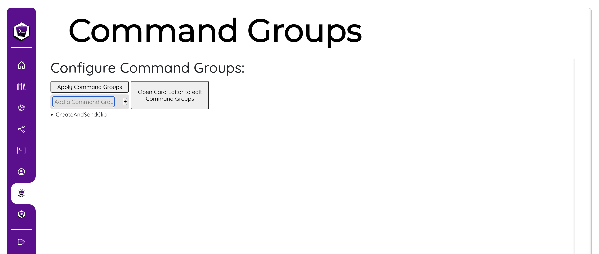
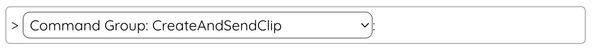
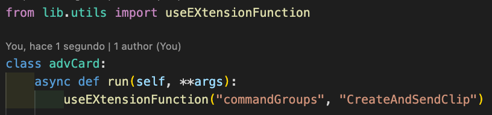

# Command Groups 

(This is a feature unlocked with [***Loot's Tools Plus***](../../plus). A ***Plus*** Account is required.)

{: style="height: 150px;width: 150px;float: left;margin: 20px;"}

*Command Groups* is an *EXtension* which allows the user to create, as the name suggest, command groups to then use them all together. Think of them as functions.

Make, for example, a function to wait 30 seconds, make a Clip of your stream, and then send it automatically to Discord for all your fans to enjoy when a Card is played.

&nbsp;

---

## Installation

[Download 'Command Groups' with LaTEX](ltex://download/commandGroups){ .md-button .md-button--primary }

---

## Setup

To create Command Groups, head up to the EXtension's page on the UI, and write the name of the Group you want to create where it says "Add a Command Group".

Press Enter to add it to the list, apply Command Groups, and edit the Command Groups on the **Loot's Tools' Editor**.

Then, to use it on Normal Cards, you can find the newly created Command Group under "EXtension Command":

{: style="width: 69%;"}

To use it on Advanced Cards, import `useEXtensionFunction` from `lib.utils`, and use `useEXtensionFunction("commandGroups", "{COMMANDGROUPNAME}")`

{: style="width: 69%;"}
