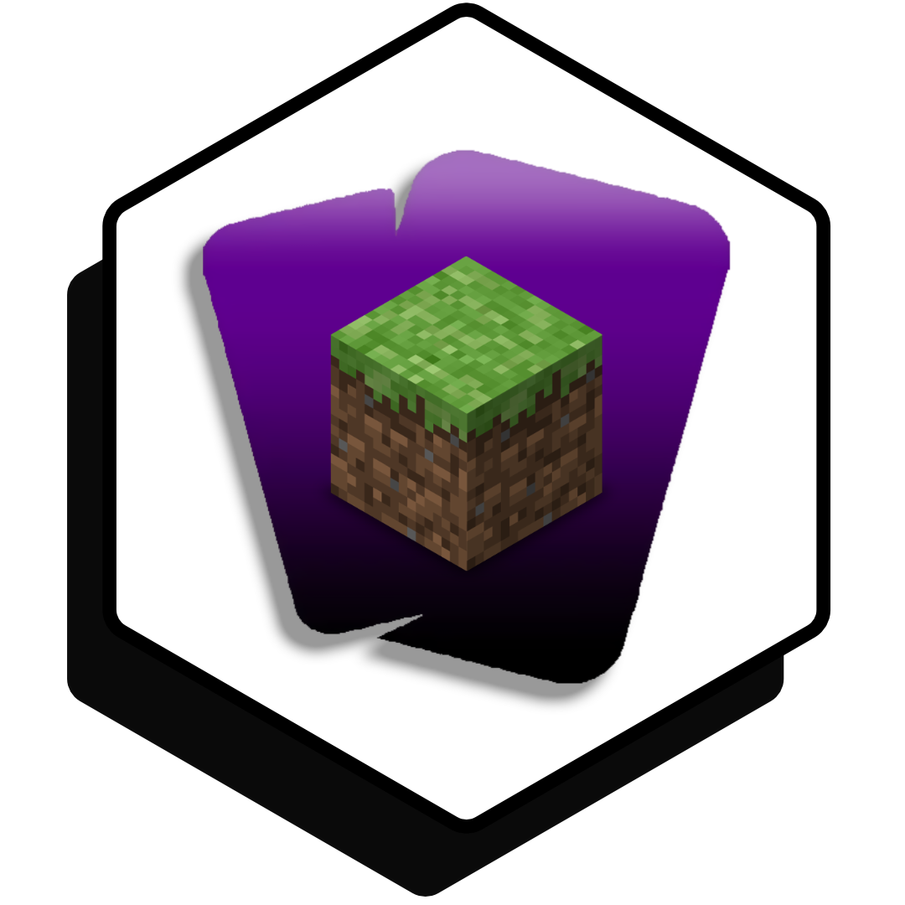
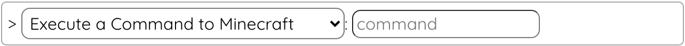

# LootsToolsEX for Minecraft

<sup style="font-size: 90%">(This is a feature unlocked with [***Loot's Tools Plus***](../../plus). A ***Plus*** Account is required.)</sup>

{: style="height: 150px;width: 150px;float: left;margin: 20px;"}

*LootsToolsEX for Minecraft* is an *EXtension* which allows the interactivity between **Minecraft** and ***Loot's Tools***.

It makes possible sending **commands** to the game and **giving pets** to players in the game.

You can see some example clips of *LootsToolsEX for Minecraft* in-game [here](https://www.youtube.com/watch?v=BqhNUN1Ft6w){target=_blank}, [here](https://www.youtube.com/watch?v=LNAmppbpLXA){target=_blank}, or [here](https://www.youtube.com/watch?v=LBEQGj77ftQ){target=_blank}.

---

## Installation

[Download 'Loot's Tools EX for Minecraft' with LaTEX](ltex://download/minecraftEX){ .md-button .md-button--primary }

---

## Setup

The EXtension creates a Bot that connects to your Minecraft Server, to then send commands when needed.

### Use Loot's Tools on your server

To use the Bot on your server, you will need to have the server on "Offline mode", since the bot doesn't have a "premium" account.

Then, on the EXtension Page on the UI, set up the host and port of the server, and click "Connect Bot".

This will connect the Bot to the Server.

### Use Loot's Tools on your singleplayer world

To use the Bot on your singleplayer world, click "Esc" on your keyboard, click "Open to LAN", enable cheats, and, when you open your world on LAN, you will have the server host and port on your chat.

Then, on the EXtension Page on the UI, set up the host and port of the server, and click "Connect Bot".

This will connect the Bot to your World.

---

## Commands

(Note: the name between parenthesis is the function's name, used for calling them with [Advanced Cards](../../cards/advCards)' Scripts)

### Execute a Command on Minecraft (minecraftCMD)

This command sends a command to Minecraft to execute.

#### Usage

{style=max-width:60%;}

#### Arguments

- **command** [str]: The command you want to execute on Minecraft.

### Spawn a pet on Minecraft (minecraftPet)

This command summons a Pet for the player specified on Minecraft.

#### Usage

{style=max-width:60%;}

#### Arguments

- **petType** [choose]: The pet's type (DOG, CAT OR PARROT).
- **petOwner** [str]: The pet's owner. If this field is ALL, the pet is given to all players on the server.
- **petName** [str]: The pet's name.

---

## Additional Notes

If on the command of [```Execute a Command on Minecraft```](#execute-a-command-on-minecraft-minecraftcmd) you put ```%PLAYER%```, that command is executed for every player online, replacing the tag for their names.
