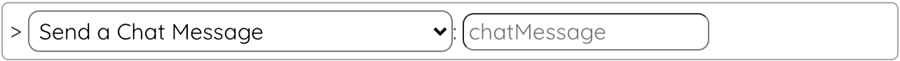
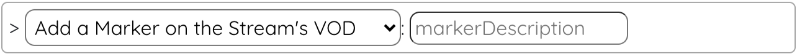
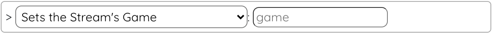
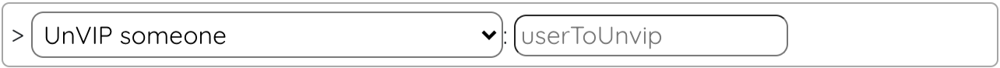
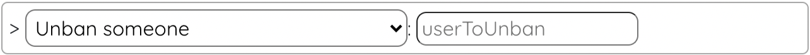

# LootsToolsEX for Twitch

<sup style="font-size: 90%">(This is a feature unlocked with [***Loot's Tools Plus***](../../plus). A ***Plus*** Account is required.)</sup>

{: style="height: 150px;width: 150px;float: left;margin: 20px;"}

*LootsToolsEX for Twitch* is an *EXtension* which allows the interactivity between **Twitch** and ***Loot's Tools***.

It makes possible things like **changing the Stream's Title** and **Game**, **sending messages** to Chat, **marking a moment** on the VOD, managing **bans** (*banning* and *unbanning*), or triggering Events on Loot's Tools on **Chat Messages**, **Channel Points Rewards Redemptions**, **Chat Commands**, **Subscriptions** or **Donations**.

The most useful thing maybe being gifting Packs with Channel Points Rewards or Subs!
&nbsp;

---

## Installation

[Download 'Loot's Tools EX for Twitch' with LaTEX](ltex://download/twitchEX){ .md-button .md-button--primary }

---

## Setup

A setup is not required in order to use this EXtension. However, you can configure the Bot to listen to Chat Commands.

You can configure them on the EXtension page on the UI, but don't forget to apply changes!

---

## Events

Events behave like Cards; edit their Commands on the Editor or make them behave like [Advanced Cards](../../cards/advCards).

### On Twitch Message

This Event is called when a message is sent on your Chat.

#### Available Data

This data is available as [Tags](../../cards/normalCards#tags) on Normal Cards, and through [Variables](../../cards/advCards#variables) on Advanced Cards and EXtensions.

- ```twitchMessage```: Returns all the info of the event.

- ```twitchMessageText``` or ```message```: Returns the message sent.

- ```twitchMessageAuthor``` or ```user```: Returns the message's author.

### On Twitch Command

This Event is called when a Chat Command is sent on your Chat. You'll need to add these Chat Commands on this EXtension's Page on the UI.

#### Available Data

This data is available as [Tags](../../cards/normalCards#tags) on Normal Cards, and through [Variables](../../cards/advCards#variables) on Advanced Cards and EXtensions.

- ```twitchCommand```: Returns all the info of the event.

- ```twitchCommandName```: Returns the Command's Name.

- ```twitchCommandText``` or ```message```: Returns the Command sent (with arguments).

- ```twitchCommandAuthor``` or ```user```: Returns the Command's author.

- ```1```: Returns the first argument.

- ```2```: Returns the second argument.

- ```...```

### On Twitch Channel Point Reward Redeem

This Event is called when a Channel Point Reward is redeemed.

#### Available Data

This data is available as [Tags](../../cards/normalCards#tags) on Normal Cards, and through [Variables](../../cards/advCards#variables) on Advanced Cards and EXtensions.

- ```twitchChannelPoint{rewardName}```: Returns all the info of the event.

- ```twitchChannelPointUser``` or ```user```: Returns the username of the user that redeemed the Channel Point Reward.

- ```twitchChannelPointUserDisplayName```: Returns the Display Name (*el nombre bonico*) of the user that redeemed the Channel Point Reward.

- ```twitchChannelPointText``` or ```message```: Returns the text imput of the Channel Point Reward redeem (If given).

- ```twitchChannelPointRewardName```: Returns the Channel Point Reward Name.

### On Twitch Bits Donation

This Event is called when a Bit Donation is done.

#### Available Data

This data is available as [Tags](../../cards/normalCards#tags) on Normal Cards, and through [Variables](../../cards/advCards#variables) on Advanced Cards and EXtensions.

- ```twitchBits```: Returns all the info of the event.

- ```twitchBitsSender``` or ```user```: Returns the username of the user that made the donation.

- ```twitchBitsAmount```: Returns the amount of Bits donated.

- ```twitchBitsTotalAmount```: Returns the total ammount of Bits donated by that user.

- ```twitchBitsMessage``` or ```message```: Returns the Donation Message (If given).

### On Twitch Subscription

This Event is called when someone subscribes to your Twitch Channel.

#### Available Data

This data is available as [Tags](../../cards/normalCards#tags) on Normal Cards, and through [Variables](../../cards/advCards#variables) on Advanced Cards and EXtensions.

- ```twitchSub```: Returns all the info of the event.

- ```twitchSubUserName``` or ```user```: Returns the username of the user that subscribed (or recieved the Subscription as a gift).

- ```twitchSubUserDisplayName```: Returns the Display Name (*el nombre bonico*) of the user that subscribed (or recieved the Subscription as a gift).

- ```twitchSubUserID```: Returns the user ID of the user that subscribed (or recieved the Subscription as a gift).

- ```twitchSubGifterUserName```: Returns the username of the user that gifted the Sub (If the Sub was gifted).

- ```twitchSubGifterUserDisplayName```: Returns the Display Name (*el nombre bonico*) of the user that gifted the Sub (If the Sub was gifted).

- ```twitchSubGifterUserID```: Returns the user ID of the user that gifted the Sub (If the Sub was gifted).

- ```twitchSubTier```: Returns the tier of the Sub (1000, 2000, 3000, or Prime).

- ```twitchSubIsGift```: Returns the boolean value if is Gift or not.

- ```twitchSubContext```: Returns the event type associated with the subscription product. (sub, resub, subgift, anonsubgift, resubgift, anonresubgift)

- ```twitchSubMessage``` or ```message```: Returns the Sub Message.

- ```twitchSubGiftedMonths```: Returns the number of months gifted (If the Sub was gifted).

- ```twitchSubTotalMonths```: Returns the number of months the user has been subscribed in total.

- ```twitchSubStreakMonths```: Returns the user’s most recent (and contiguous) subscription tenure streak in the channel.

---

## Commands

(Note: the name between parenthesis is the function's name, used for calling them with [Advanced Cards](../../cards/advCards)' Scripts)

### Send a Chat Message (twitchSend)

This command sends a message to your Chat on Twitch.

#### Usage

{style=max-width:60%;}

#### Arguments

- **chatMessage** [str]: The message you want to send.

### Add a Marker on the Stream's VOD (twitchMarker)

This command marks a moment in the VOD.

#### Usage

{style=max-width:60%;}

#### Arguments

- **markerDescription** [str] (Optional): The description of the marker.

### Set the Stream's Game (twitchSetGame)

This command sets the game of your Twitch's stream.

#### Usage

{style=max-width:60%;}

#### Arguments

- **game** [str]: The name of the game.


### Set the Stream's Title (twitchSetTitle)

This command sets the game of your Twitch's stream.

#### Usage

{style=max-width:60%;}

#### Arguments

- **title** [str]: The title you want to put on your Twitch's stream.

<!--
### VIP Someone (twitchVIP)

This command makes a user VIP on your Twitch's chat.

#### Usage

{style=max-width:60%;}

#### Arguments

- **user** [str]: The user you want to make VIP.


### UnVIP Someone (twitchUnVIP)

This command takes away a user's VIP on your Twitch's chat.

#### Usage

{style=max-width:60%;}

#### Arguments

- **user** [str]: The user from who you want to take away its VIP.
 -->

### Ban Someone (twitchBan)

This command bans a user from your Twitch's chat.

#### Usage

{style=max-width:60%;}

#### Arguments

- **userToBan** [str]: The user you want to ban.

### Unban Someone (twitchUnban)

This command unbans a user from your Twitch's chat.

#### Usage

{style=max-width:60%;}

#### Arguments

- **userToUnban** [str]: The user you want to unban.
