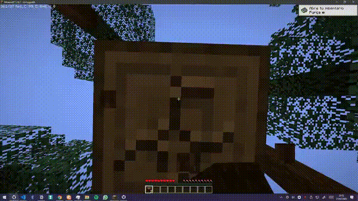
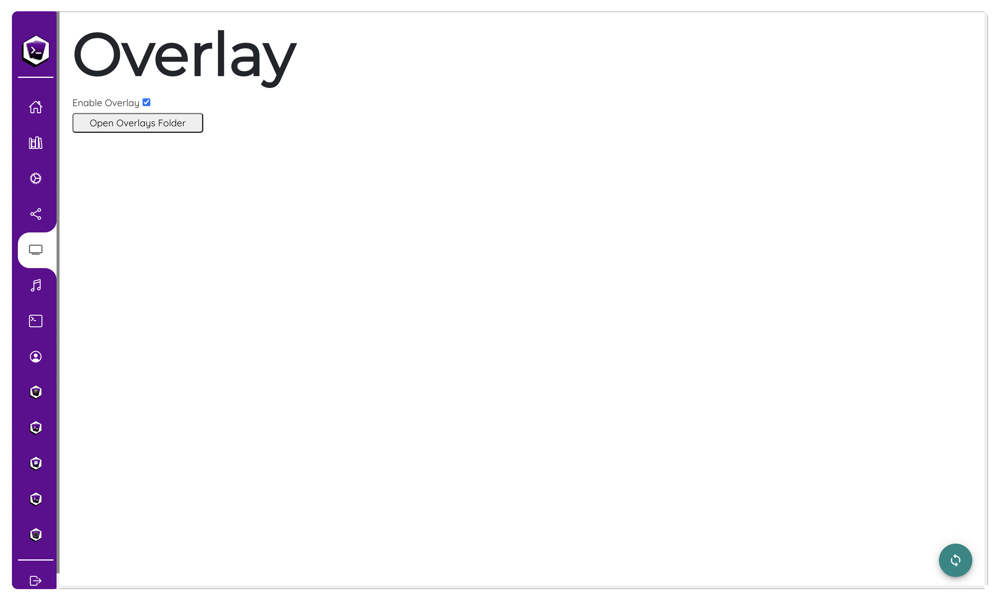
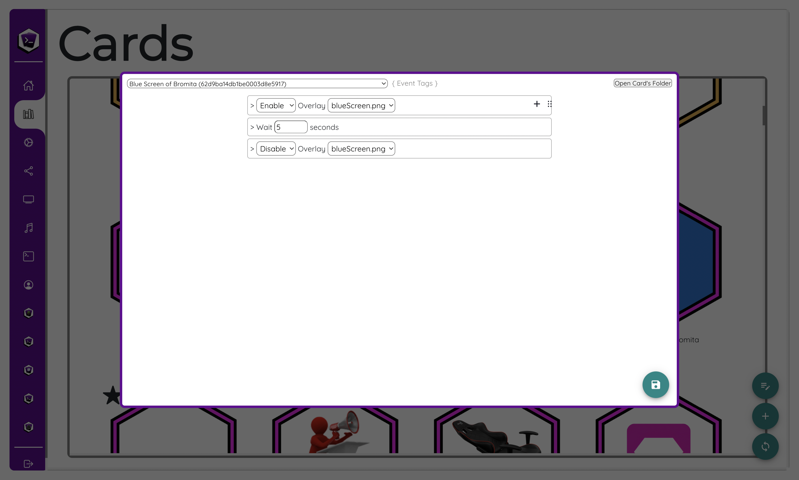

# Loot's Tools Overlay

<a style="display: flex;justify-content: center;">
{: style="margin: 0 auto;width:80%"}
</a>

Introduced on v3, the ***Loot's Tools Overlay*** offers a way for ***Loot's Tools*** users to overlay images over their screen with Streamloots Cards or other events.

This could be useful for jumpscares (could help using it with the [Play Sound Command]()), scares (like a [example we will see later on](#example).), "flashbanging" (with an all-white image), blinding the streamer (with an all-black image) or hiding information from the game's UI superposing these images.

!!! note

    The Overlay will not work on Fullscreen apps or games. Find a way to execute your app or game in windowed borderless mode.

---

## Add images

To add images to the list of Overlays you will only need to drop them on the Overlay Folder on your Loot's Tools Folder.



Go to the Overlay Page on the UI and click on "Open Overlay Page", this will open the Overlay Folder. Drop there your images and *et voilà!*, that image will be ready to select on Commands.

On the case they don't automatically appear, go to the Overlay Page on the UI and hit the reload icon. (<ion-icon name="reload-outline"></ion-icon>)

This will reload them manually.

---

## Toggle Overlays

Once we get our image files loaded, to toggle the Overlays with Commands we'll need to go to the Editor, edit any Card or Event, and Enable the Overlay, then wait x seconds, and finally Disable it.



---

## Example

An example for the Overlay Commands and functions would be the ***Blue Screen of Death Card*** I made.

<a style="display: flex;justify-content: center;">
{: style="margin: 0 auto;width:80%"}
</a>

You can copy it on your Collection clicking here:

[Copy "Blue Screen of Bromita" Card with LootsTrading](lootstools://copyCard/62d9ba14db1be0003d8e5917){ .md-button .md-button--primary }

The commands used are really simple, and are the ones showed on the [Toggle Overlays](#toggle-overlays) section.


---

## EXtensions and Advanced Card use

### Overlays in a nutshell

...are [PyGame Surfaces](https://www.pygame.org/docs/ref/surface.html).

The Loot's Tools Overlay is based on PyGame, and you can do cool functions to show on it with this library. But you can also do basic ones, like the one used to show the images on it:

``` py
def imgOverlay():
    image = pygame.image.load(path)
    modules().overlay.screen.blit(image, (0, 0))
```

For this example, we'll make a rapidly-changing-color square, of dimensions of 60x60 and on the coordenates (30, 30):

``` py
def randomOverlay():
    pygame.draw.rect(modules().overlay.screen, (random.randint(0, 255), random.randint(0, 255), random.randint(0, 255)), pygame.Rect(30, 30, 60, 60))
```

### Adding Custom Overlays to the userOverlays list

The Overlay Module has a dictionary that houses all the usable Overlays for the user. So, to add yours to the list and for it to be able to be toggled on the UI, you'll need to do something like this:

``` py
def randomOverlay():
    pygame.draw.rect(modules().overlay.screen, (random.randint(0, 255), random.randint(0, 255), random.randint(0, 255)), pygame.Rect(30, 30, 60, 60))

modules().overlay.userOverlays["random"] = (randomOverlay)
```

That function will make a 60x60 square of rapidly-changing colours, and then add it to the list of Overlays under the name "random". This way it can be later [enabled or disabled with Commands on normal Cards](#toggle-overlays). If you are interested on [toggling Overlays on Advanced Cards or EXtensions](#toggle-overlays-with-advanced-cards-or-extensions).

### Toggle Overlays with Advanced Cards or EXtensions

Now that we have created our Overlay, we'll need to enable and disable it, right?

This can be made by 2 ways: [With normal Cards](#toggle-overlays) or with Advanced Cards and EXtensions; we'll be focusing now on the second one.

Now, as the overlay is only rendering images, it refreshes at **1 fps**. Every frame, every item from a list is executed and rendered on the Overlay, this list being called "overlay". So, to enable our overlay we'll have to get its function inside that list for the renderer to display it on screen.

#### Toggling Overlays on the userOverlays list

If we want to render a overlay on the `userOverlays` list, we'll have to get its function and then add it to the Overlay Dict:

``` py
overlayName = "blueScreen.png"
overlayFunction = modules().overlay.userOverlays[overlayName]
modules().overlay.overlays[overlayName] = (overlayFunction)
```

To remove it, it would be a similar thing:

``` py
overlayName = "blueScreen.png"
modules().overlay.overlays.pop(overlayName)
```

#### Toggling Custom Overlays

However, if we have made a custom Overlay, we already have its function, so you'll have to give it a name and then add it to the Overlay Dict:

``` py
def randomOverlay():
    pygame.draw.rect(modules().overlay.screen, (random.randint(0, 255), random.randint(0, 255), random.randint(0, 255)), pygame.Rect(30, 30, 60, 60))

overlayName = "random"
modules().overlay.overlays[overlayName] = (randomOverlay)
```

Removing it is the same story as before:

``` py
overlayName = "random"
modules().overlay.overlays.pop(overlayName)
```