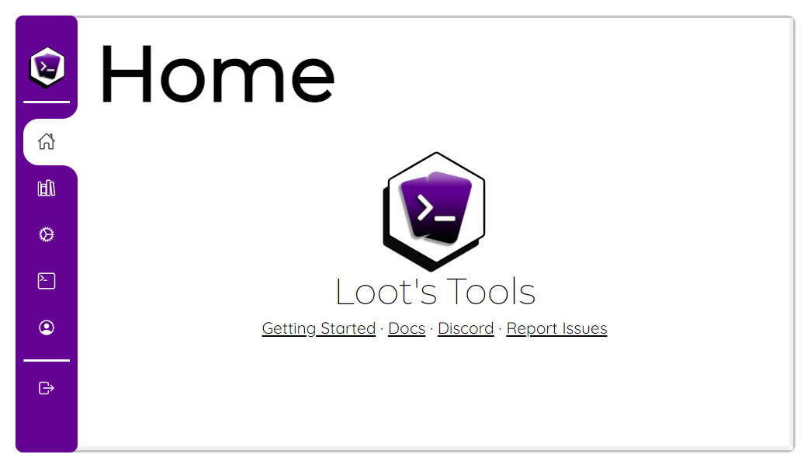

# Getting Started with Loot's Tools Desktop

So you're new around here, huh? I'm glad you stopped by!

Originality on streams is very important for me, thats why I made Loot's Tools, but let's not distract ourselves, let's see how you can start using ***Loot's Tools Desktop***!

---

## Download Loot's Tools Desktop

You can download the Installer [clicking here](../../desktop/ltSetup.exe){target=_blank} if you are on Windows, or download Loot's Tools [clicking here](https://github.com/daryedev/lootstools/releases/latest/download/LootsTools.app.zip){target=_blank} if you are on Mac.

---

## Set it up! (Windows)

Open ```ltSetup.exe```, select the directory you want to install Loot's Tools in, let it download the latest Loot's Tools version and let's proceed.

---

## Set it up! (Mac)

Create a new folder and drop ```LootsTools.app``` on it, then run it for a first time to install and set up what it needs to work properly.

---

## Login with Streamloots

You'll now need to login with Streamloots to use Loot's Tools, so you'll need to install a Browser extension to login:

- [Download *Loot's Tools Browser Companion* for Chromium browsers](https://chrome.google.com/webstore/detail/nkoepodlaleolfmllaibllelcefbphfp){target=_blank}

- [Download *Login to Loot's Tools* for Firefox](https://addons.mozilla.org/en-US/firefox/addon/login-to-loot-s-tools/){target=_blank}

To log in, once you install the extension, go to [Streamloots](https://www.streamloots.com){target=_blank} and, once you log in on there, click on the extension's icon. If you had installed the *Browser Companion*, now click on "Login on Loot's Tools".

Loot's Tools will open, but now you'll logged in.

---

## A fresh new face: Loot's Tools UI

Once you have installed ***Loot's Tools Desktop***, you can access [*Loot's Tools UI*](https://lootstools.darye.dev/app){target=_blank} (or open ```LootsTools.exe```) and be greeted with ***Loot's Tools UI***.

<a href="https://lootstools.darye.dev/app">
{:style="margin: auto;"}
</a>

Continue learning about it clicking here: [Loot's Tools UI](../../desktop/lootsToolsUI)

---

## Optional: Install Loot's Tools UI as a Desktop App

When going to the [*Loot's Tools UI*](https://lootstools.darye.dev/app){target=_blank}, on **Chromium-based browsers** appears an "Install" icon on the right side of the address bar: {: style="height: auto;margin: 10px"}

Clicking this, you can install the UI as a Desktop App, looking better and independent from the browser!

---
## Ok, what now?

You can head on to [Cards](../../desktop/cards/index.md) and learn how to enhance your Cards, how to program them and have some examples for you to start!

Also, take a look into the [EXtensions](../../desktop/extensions/index.md), as they expand the capabilities of Loot's Tools with new Commands, new Functions and more Events that can trigger the last ones. Great examples are the [Twitch](../../desktop/extensions/twitch/index.md) and [Commands Groups](../../desktop/extensions/commandGroups/index.md) EXtensions, so check them out!

---

<center>Share what you make or give suggestions on the [Discord Server](https://discord.io/Darye){target=_blank}!
<br>

<p style="font-size:35px;">Have fun with <b><i>Loot's Tools </b></i>!</p></center>
